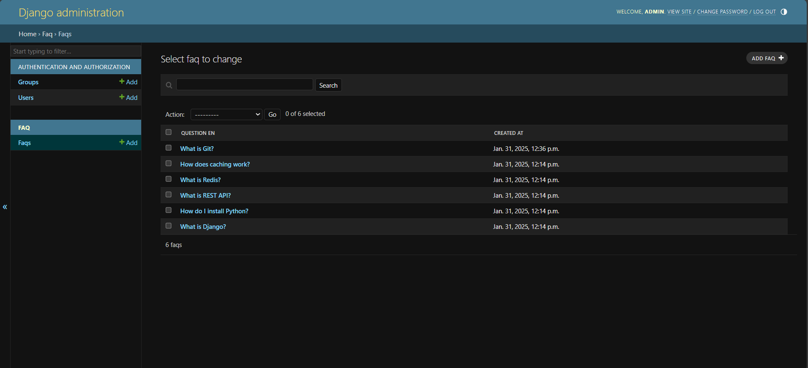
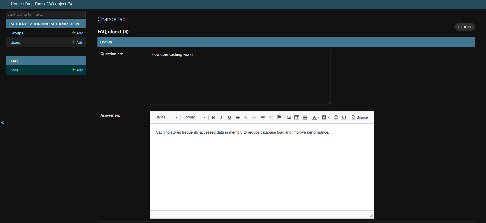
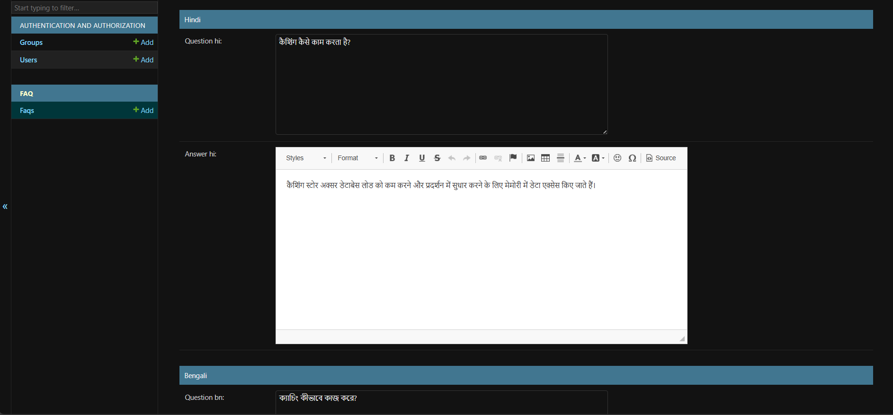
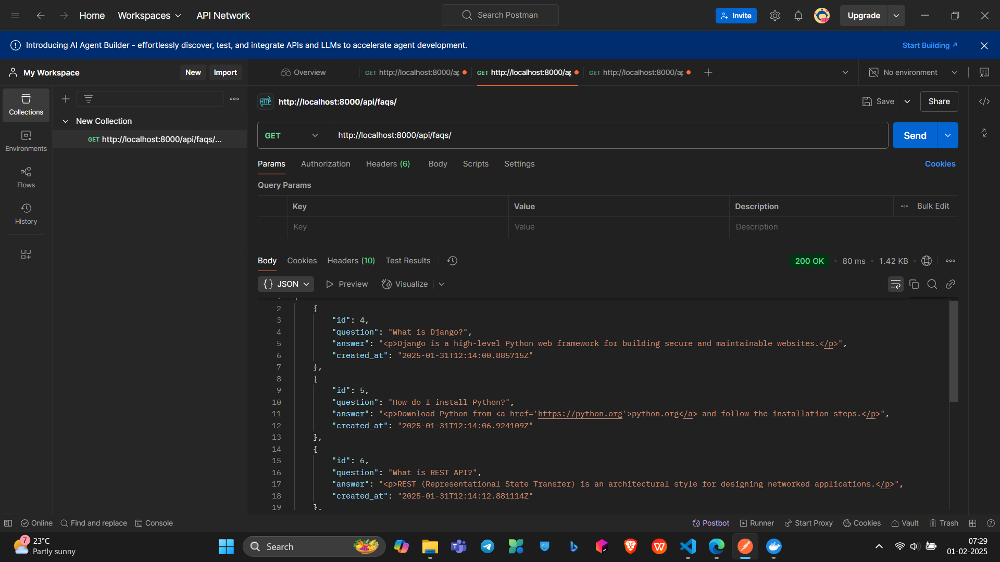

# FAQ Project

A Django-based FAQ system with multilingual support and caching.

## Features
- Multilingual FAQs (English, Hindi, Bengali).
- REST API with language selection.
- Redis caching for improved performance.
- Automatic translation using Google Translate API.

## Installation

### Prerequisites
- Python 3.9+
- Redis (for caching)
- Google Translate API key (optional, for automatic translations)

### Steps
1. Clone the repository:
   ```bash
   git clone https://github.com/sushilsharma8/faq_project.git
   cd faq_project
   ```

2. Create a virtual environment and activate it:
   ```bash
   python -m venv env
   source env/bin/activate
   ```

3. Install dependencies:
   ```bash
   pip install -r requirements.txt
   ```

4. Install Redis:
   ```bash
   sudo apt-get install redis-server
   ```

5. Create a superuser:
   ```bash
   python manage.py createsuperuser
   ```

6. Set up the database:
   ```bash
   python manage.py migrate
   ```

7. Start the Redis server (for caching):
   ```bash  
   redis-server
   ```

8. Start the development server:
   ```bash
   python manage.py runserver
   ```

9. Open your browser and navigate to `http://localhost:8000/` to view the FAQ system.

10. Access the admin panel at http://localhost:8000/admin/.

    Use the WYSIWYG editor to add and manage FAQs.

11. To stop the development server, press `Ctrl+C`.

## Usage

### API
The FAQ system provides a REST API for interacting with the FAQs. The API endpoints are:

- `GET /api/faqs/`: Retrieves all FAQs.
- `GET /api/faqs/?lang=hi`: Retrieves all FAQs in Hindi.
- `GET /api/faqs/?lang=bn`: Retrieves all FAQs in Bengali.

## Example Response

```json
[
  {
    "id": 1,
    "question": "What is Python?",
    "answer": "<p>Python is a programming language.</p>",
    "created_at": "2025-01-31T12:14:00.885715Z"
  }
]
```

## Testing
To run the tests, use the following command:

```bash
python manage.py test faq
```

## Screenshots
Admin Panel:




FAQ List:


## Docker Commands
### Start Redis
```bash
docker run -d -p 6379:6379 --name redis redis:alpine
```

### Stop Redis
```bash
docker stop redis
```

### Restart Redis
```bash
docker restart redis
```

### Remove Redis Container
```bash
docker rm redis
```

### Clear Redis Cache
```bash
docker exec -it redis redis-cli flushall  
```

# Assignment Requirements Checklist

- Django models with WYSIWYG editor support.
- Multilingual FAQ storage and retrieval.
- REST API with language selection.
- Redis caching for improved performance.
- Unit tests for models and API.
- Detailed README with installation and usage instructions.